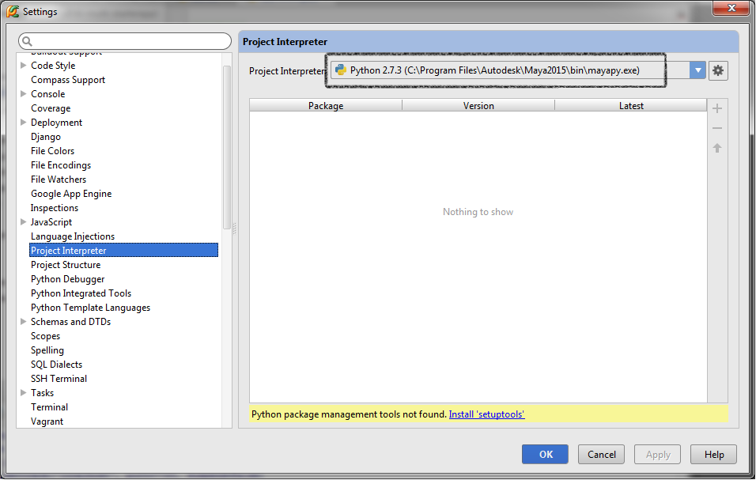
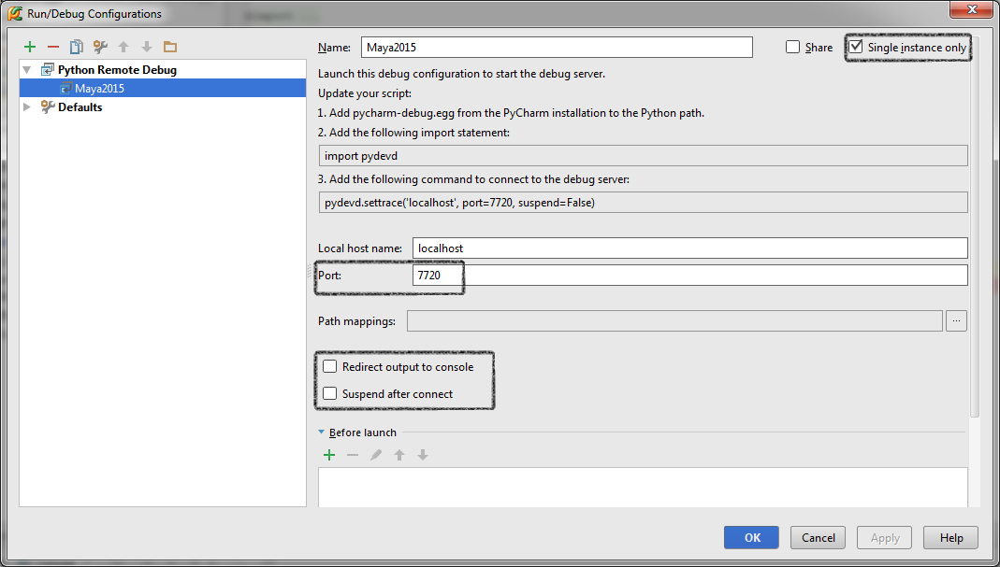
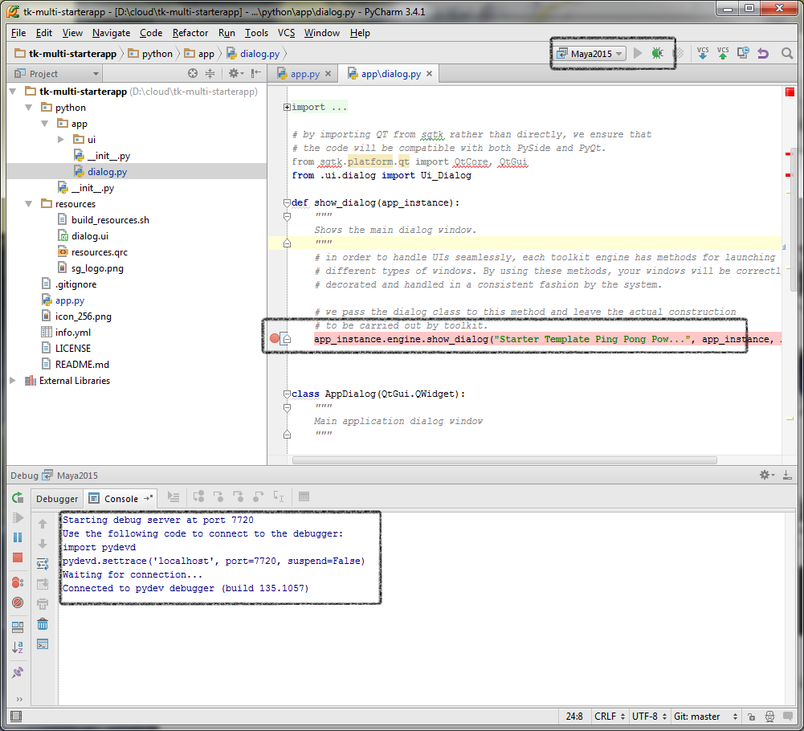
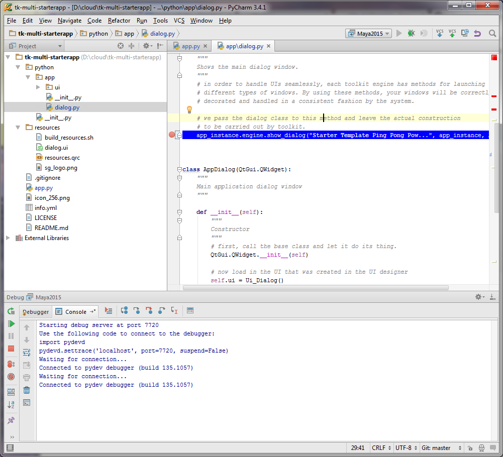

### Maya Python Remote Debugging with PyCharm

1. Get [PyCharm](http://www.jetbrains.com/pycharm/download). (Pro required or does free version now support Maya Debugging?)

1. Setup a PyCharm project to use the Maya Interpreter (File > Settings > Project Interpreter). 

1. Add a Remote Debugging Configuration: Run > Edit Configurations
  1. Add > Python Remote Debug
  1. Name Configuration
  1. Check "Single instance only" ON
  1. Set the port (i.e 7720)
  1. Uncheck both “Redirect to console Input” and  ”Suspend after connect”. 

1. In PyCharm add a break point somewhere and press debug. A progress indicator and "Waiting for connection" shows near the bottom and prints to debug console. .

1. Ensure PyCharm debug is on Maya's Python path, one way is with a Maya startup script:
```python
# <UserDocs>\maya\2016\prefs\scripts\userSetup.py
import sys
sys.path.append('C:\Program Files (x86)\JetBrains\PyCharm 5.0.2\debug-eggs\pycharm-debug.egg')
```

1.  Connect Maya to the PyCharm debug server using the same port from configuration. PyCharm's "waiting connection" should hide and "Connected to pydev debugger..." prints in debug console.
```python
# Inside Maya Python Console (Tip: add to a shelf button for quick access)
import pydevd
pydevd.settrace('localhost', port=7720, suspend=False)
# To disconnect run:
# pydevd.stoptrace()
```

1. Run the script with the breakpoint and hope it will be hit! 
